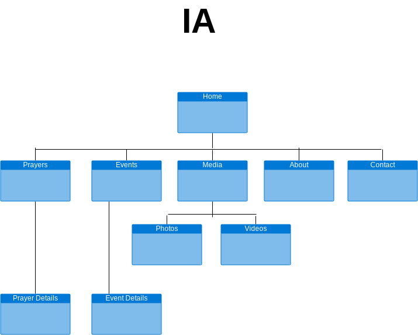
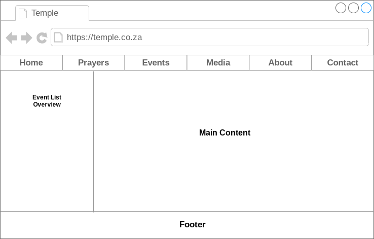

# Pre-Production Temple Site

## Content and Purpose

    - To allow devotees to make donations.
    - To allow devotees to create posts for events.
    - To allow devotees to upload videos of past events.
    - To allow any visitor to get information on temple and temple history.
    - To allow devotees to read up on the goddess the temple is devoted too.
    - To allow devotees booked the temple for events.
    - To allow devotees to get a list of items associated for different prayers the temple offers.
    - Must have a list of prayers and dates prayers are offered, and costs associated for prayer.

## Persona's

    - Elderly
        - Very rarely uses internet, age 60, and above, if they do use internet, it must be easy to learn, and use.

    - Middle aged
        - Age 40 to 60, quiet fluent with internet, uses internet roughly 5 hours a week.

    - Young adults
        - Age 20 to 40, understand the ins and outs of internet, uses regularly, 10+- hours a week.

    - Children
        - Age 5 to 20, enjoys the fun aspects of the internet, spends a large amount of their time on internet.

## Brainstorm theme

    Title
        - Sri Kamacheeaumun Temple Society
        - Goddess
        - The Temple of the Goddess
    
    Visual Metaphor
        - Pictures of Goddesses
        - Picture of temple
        - Goddesses foods
        - Sari
 
    Color
        - Dark Blue, white, gray, dark green

## IA

## Mockup Temple Site Landing Page

